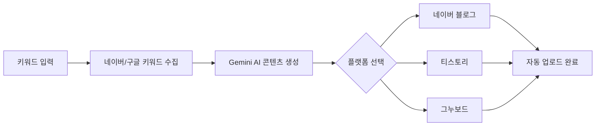

# 마케팅 자동화 프로그램 (Marketing Automation Program)

> **AI 기반 키워드 수집, 콘텐츠 생성 및 다중 플랫폼 자동 업로드 통합 솔루션**
> 본 프로젝트는 키워드 조사부터 AI 콘텐츠 작성, 네이버/티스토리 등 다채널 플랫폼 업로드까지 마케팅 파이프라인 전 과정을 자동화하는 통합 시스템입니다.

---

## 📺 서비스 흐름도



---

## 주요 기능

* **키워드 수집 모듈**: 네이버/구글 API를 활용한 자동완성 키워드 추출 및 검색량·경쟁도 분석 기능을 제공합니다.
* **AI 콘텐츠 생성**: Gemini 1.5 Flash를 연동하여 사용자 정의 프롬프트 기반의 블로그 및 뉴스 스타일 원고를 자동 생성합니다.
* **숏폼 영상 자동 제작**: 텍스트 콘텐츠를 기반으로 이미지와 TTS 음성이 결합된 마케팅용 숏폼 영상을 생성합니다.
* **멀티 플랫폼 자동 업로드**: Selenium 기반으로 네이버, 티스토리, 그누보드 계정별 자동 로그인 및 포스팅 업로드를 지원합니다.

---

## 트러블슈팅 및 인사이트

### 1. 기술적 정밀도 확보: 음성-영상 싱크 불일치 해결

* **문제**: 자동 생성된 숏폼 영상에서 음성(TTS)과 영상 화면 간의 싱크가 맞지 않아 시청 경험이 저하되는 문제 발생.
* **해결**: 각 문장별 **TTS 음성 파일의 길이를 정밀하게 측정**하고, 해당 길이에 맞춰 이미지 클립의 Duration을 **1:1로 매칭**하는 로직을 구현하여 싱크를 완벽히 보장함.
* **결과**: 영상과 음성의 괴리를 제거하여 고품질의 마케팅 영상을 안정적으로 생성할 수 있게 됨.

### 2. 사용자 경험(UX) 중심의 설계: 플랫폼 통합 관리

* **문제**: 마케팅 채널마다 별도의 툴을 사용해야 하는 번거로움과 플랫폼별 로그인/업로드 방식의 차이로 인한 운영 리소스 과다 발생.
* **해결**: 블로그로 유명한 주요 플랫폼들을 하나의 솔루션 내에서 제어할 수 있도록 통합 모듈을 설계하여 한 곳에서 모든 마케팅 업무가 가능하도록 개선.
* **결과**: 다채널 운영 효율을 극대화하여 수동 작업 대비 **업무 시간을 약 90% 이상 절감**함.

---

## 기술 스택

**기술 스택:** Python 3.11, Gemini 1.5 Flash, Selenium 4.34.2, Moviepy, FFmpeg, Tkinter, PyInstaller 6.14.2

---

## 프로젝트 구조

```bash
marketing_program/
├── 공유용_ALL/              # 통합 실행 버전 (모든 플랫폼 지원)
│   ├── main.py             # GUI 메인 실행 파일
│   ├── config.ini          # 플랫폼 계정 설정
│   └── uploader_modules/   # 각 플랫폼별 업로드 엔진
├── 1. 키워드 추출/          # 네이버/구글 API 연동 모듈
├── 2. ai_writer/           # Gemini API 기반 원고 생성 모듈
└── 3. shorts_generator/    # 영상 및 TTS 합성 모듈

```
